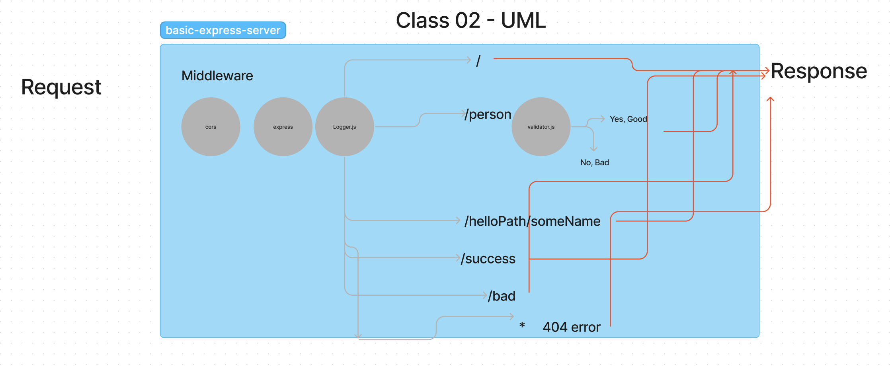

# Lab 2 - Class 02
___

## basic-express-server
___

#### Author: Eva Grace Smith

#### Problem Domain

This is a basic express server, utilizing middleware, and generating tests.

### Links and Resources

- [GitHub Actions ci/cd](https://github.com/rkgallaway/server-deployment-practice-d51/actions)

[Deployment](https://basic-express-server-zq44.onrender.com/)

[Pull request for grading purposes](https://github.com/EvaGraceSmith/basic-express-server/pull/2)

### Collaborators

 TA Daniel Frey

### Setup

#### `.env` requirements (where applicable)

PORT=

#### How to initialize/run your application (where applicable)

-  `npm index.js`

#### How to use your library (where applicable)

#### Features / Routes

- GET : `/person` - utilizes validator.js

#### Tests

- How do you run tests?
`npm test`

#### UML

